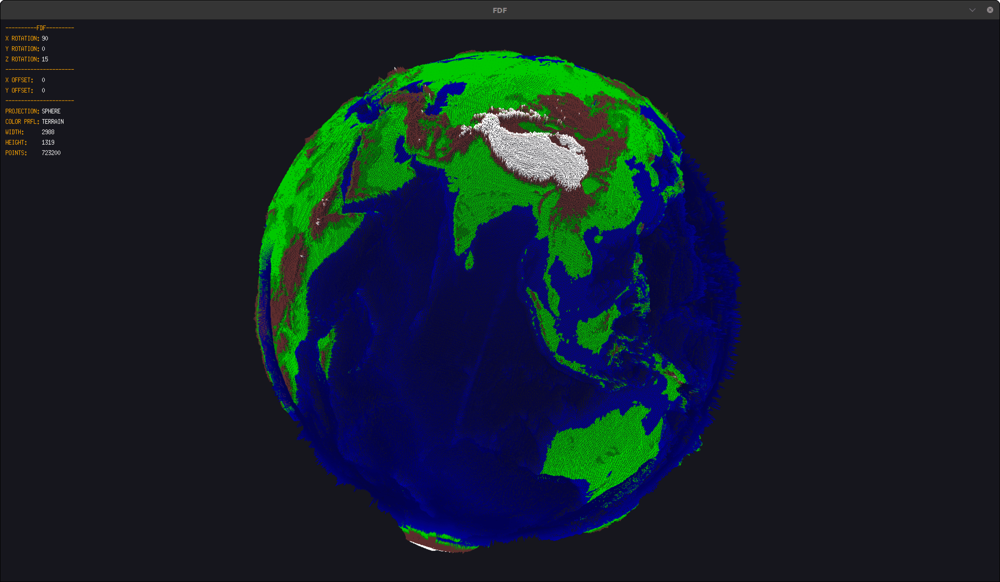
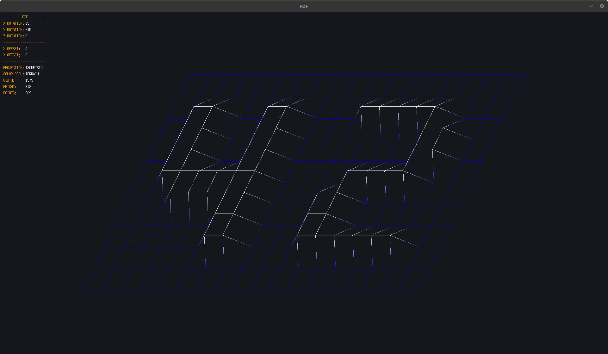
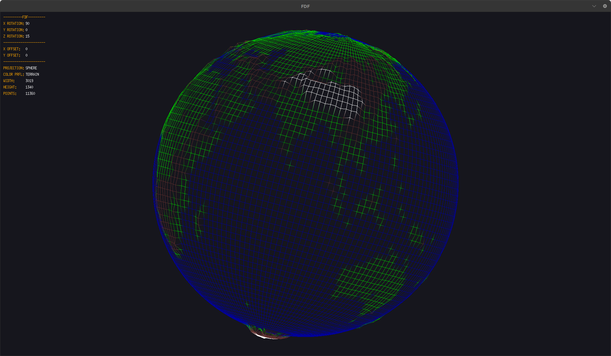

# FdF – 3D Wireframe Viewer

FdF turns a plain-text height-map (`.fdf`) into an interactive 3-D wireframe.  
It’s my implementation of the legendary **42 School** graphics project, built in C on **MiniLibX**.

## ✨ Features
* Real-time rendering of large height maps  
* Five projections — **Isometric, Dimetric, Trimetric, Free, Globe**  ([Fdf/inc/fdf.h at main · Tuncayarda/Fdf · GitHub](https://github.com/Tuncayarda/Fdf/blob/main/inc/fdf.h))  
* Wireframe / filled-polygon toggle and terrain color profile  
* Smooth zoom, Z-scale, rotation and panning  
* Menu overlay showing the current parameters  
* Make targets for **1080p, 2 K and 4 K** window sizes  ([Fdf/Makefile at main · Tuncayarda/Fdf · GitHub](https://github.com/Tuncayarda/Fdf/blob/main/Makefile))

---

## 🎬 Demo



---

## 📸 Screenshots

| Projection | Wireframe |
|------------|-----------|
| **Isometric** |  |
| **Globe** |  |

---

## 🚀 Getting Started

### Prerequisites
```bash
sudo apt install build-essential libx11-dev libxext-dev
```
> Tested on Ubuntu 22.04; any X11-based Linux should work.

### Clone & Build
```bash
git clone --recurse-submodules https://github.com/Tuncayarda/Fdf.git
cd Fdf
make         # 1920×1080 window
# or
make 2k      # 2560×1440
make 4k      # 3840×2160
```
The **`fdf`** binary will appear in the project root.  ([Fdf/Makefile at main · Tuncayarda/Fdf · GitHub](https://github.com/Tuncayarda/Fdf/blob/main/Makefile))

---

## ▶️ Running
```bash
./fdf test_maps/42.fdf
```
A rich set of sample maps lives in **`test_maps/`**.  ([Fdf/test_maps at main · Tuncayarda/Fdf · GitHub](https://github.com/Tuncayarda/Fdf/tree/main/test_maps))

---

## ⌨️ Keyboard Shortcuts

| Key | Action |
|-----|--------|
| `1 2 3 4 0` | Switch projection |
| `W A S D Q E` | Rotate (Free projection) |
| `← ↑ ↓ →` | Pan (Free projection) |
| `Z / X` | Zoom in / out |
| `C / V` | Increase / decrease Z exaggeration |
| `F / H` | Toggle filled-polygon mode |
| `N / T` | Toggle color profile (None / Terrain) |
| `Esc` | Quit |

---

## 📄 Height-map Format

Each row is a series of integers (optionally `,0xRRGGBB`) separated by spaces, e.g.:

```
0 0 1 2 3
0 1 2 3 4
```

See the provided maps for concrete examples.

---

## 🗺️ Roadmap
- Mouse-driven rotate & zoom  
- Alternative color schemes  
- PNG screen-capture

---

## 📝 License

MIT — see `LICENSE`.

> **Image convention:** keep all screenshots/GIFs inside `docs/images/` so GitHub renders them automatically.
```

Happy documenting
